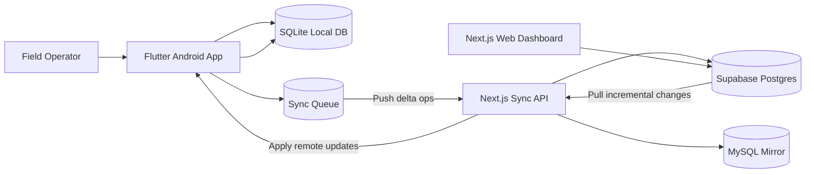

# StockMind Hybrid Architecture

## Decision summary
- Android offline storage uses **SQLite** (inside Flutter) because on-device MySQL is not production-safe for mobile.
- **MySQL** is preserved as a secondary mirror in the sync middleware layer to satisfy the dual-database business requirement.
- **Supabase** remains the cloud source of truth.

## Diagram

## Sync strategy
- Conflict strategy: **server-authoritative last-write-wins** using `updated_at` and `row_version`.
- Push path:
  1. Mobile writes are committed locally first.
  2. Each write creates a queue operation (`upsert` or `delete`).
  3. Sync API validates auth and applies operation to Supabase.
  4. Sync API mirrors same row to MySQL when configured.
  5. API returns ack/conflict/failure per operation.
- Pull path:
  1. Mobile sends per-table checkpoints.
  2. Sync API returns rows where `updated_at > checkpoint`.
  3. Mobile upserts remote rows into SQLite and updates checkpoints.

## Local metadata fields
Each local entity tracks:
- `local_id`
- `remote_id`
- `created_at`
- `updated_at`
- `deleted_at`
- `sync_status`
- `last_synced_at`
- `device_id`
- `row_version`

## Inventory administration extension
- New dictionary tables:
  - `inventory_categories`
  - `inventory_locations`
- Extended title metadata in `books_master`:
  - `author`, `publisher`, `edition`, `list_price`
- Web administration APIs (admin-only via existing middleware):
  - `/api/reference/categories*`
  - `/api/reference/locations*`
  - `/api/inventory*` (list + edit + safe delete)
  - `/api/reports/sales-csv`, `/api/reports/inventory-csv`
- Delete strategy:
  - default soft delete (`deleted_at`, `updated_at`, version increment on synced tables)
  - hard delete only with explicit confirmation token and linked-record safety checks
- Existing add/scan/sales/sync routes remain intact for backward compatibility.

## Security model
- Web login credentials and signing secret are mandatory environment variables (no insecure defaults).
- Web and mobile login endpoints use in-memory rate limiting.
- Sync endpoints require either:
  - mobile bearer token from `/api/mobile/auth/login`, or
  - `x-sync-token` shared secret.
- Sync routes enforce payload bounds and timestamp validation.
- Supabase RLS + grants are least-privilege:
  - `books_master`: anon/authenticated `SELECT, INSERT`
  - `book_copies`: anon/authenticated `SELECT, INSERT`
  - `sales`: anon/authenticated `SELECT` only
- Secrets are env-based; no hardcoded credentials.
